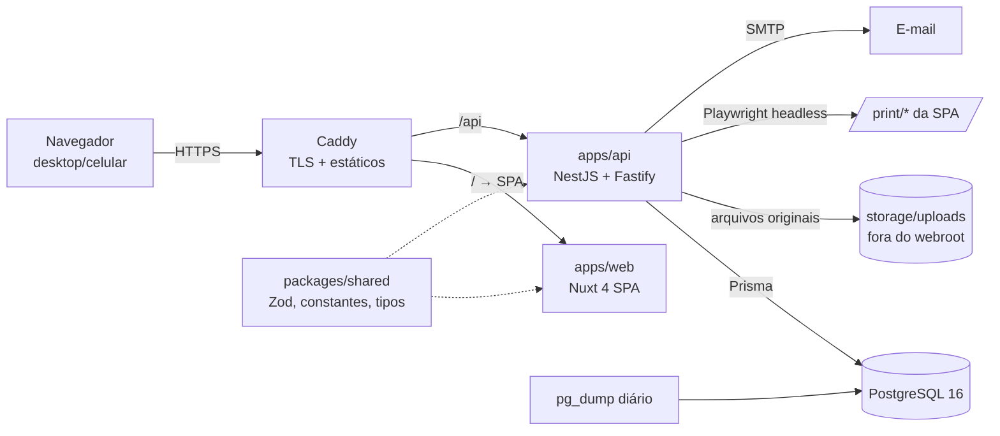

# Visão geral da arquitetura

## Componentes
| Componente | Responsabilidade |
|---|---|
| apps/web | SPA (ssr: false). Rotas, layouts, filtros na URL, gráficos ECharts, chamadas via TanStack Query. Nenhuma regra de segurança depende dela. |
| apps/api | Auth, RBAC (CASL), escopo de dados, importação, agregações de KPI, exportação xlsx/pdf, auditoria. |
| packages/shared | Schemas Zod (DTOs, filtros, importação), constantes (UF→região, papéis, permissões, status), tipos. |
| PostgreSQL | Fonte única de dados. |
| Caddy | HTTPS automático, serve a SPA, proxy `/api`. |

## Fluxos principais
1. **Login:** POST /api/auth/login → access token (15 min, em memória no front) + refresh token rotativo em cookie httpOnly/secure/sameSite=strict.
2. **Dashboard:** filtros (URL) → GET /api/dashboard/... → `ScopedPedidosRepository` aplica escopo → agregações em SQL com Decimal.
3. **Importação:** upload → parse/validação → prévia → confirmação → transação → lote.
4. **PDF:** POST /api/export/pdf → token de impressão de uso único → Playwright abre `/print/relatorio?token=` → SPA busca dados com o token → `page.pdf()` → auditoria.

## Princípios
- Escopo aplicado em um único ponto (`ScopedPedidosRepository`).
- Monólito modular; sem Redis/filas/microsserviços (≈1.000 pedidos/ano).
- Tudo em TypeScript estrito; validação Zod nas bordas.
